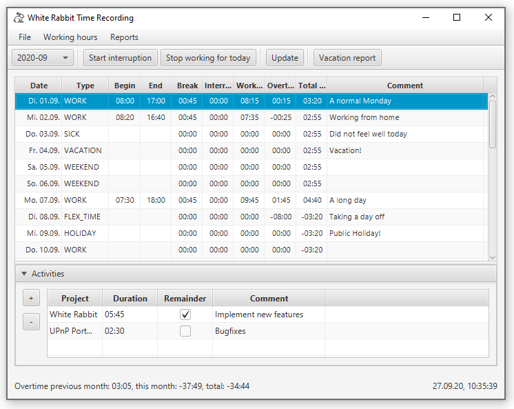

# white-rabbit
A time recording tool

[](https://github.com/itsallcode/white-rabbit/actions?query=workflow%3ABuild)
[](https://sonarcloud.io/dashboard?id=org.itsallcode.whiterabbit%3Awhite-rabbit)
[](https://sonarcloud.io/dashboard?id=org.itsallcode.whiterabbit%3Awhite-rabbit)
[](http://search.maven.org/#search%7Cga%7C1%7Cg%3A%22org.itsallcode.whiterabbit%22%20a%3A%22whiterabbit-plugin-api%22)

* [Features](README.md#features)
* [Usage](README.md#usage)
* [Changelog](CHANGELOG.md)
* [Development](README.md#development)



## <a name="features"></a>Features

* Records begin, end and interruption of your working day
* Data storage in human readable json files, one file per month
  * Backup data by creating a git repository for the data folder and commit every day
* Supported day types (see json example):
  * Normal working day (default for Monday to Friday): `WORK`
  * Weekend (Saturday and Sunday, detected automatically): `WEEKEND`
  * Public holiday (won't deduct overtime): `HOLIDAY`
  * Vacation (won't deduct overtime): `VACATION`
  * Flex time (will deduct overtime): `FLEX_TIME`
  * Sickness (won't deduct overtime): `SICK`
* Automatic update in the background: just keep it running, and it will record your working time:
  * Start of work is detected when
    * Program start
    * Computer resumes from sleep in the morning
  * Detects the end of work when
    * Program shutdown
    * Computer sleeps for the rest of the day
    * You click the "Stop working for today" button
  * Interruptions detected when computer sleeps for more than 2 minutes
* Generates reports for your vacation and monthly working time
* Detects when a second instance is started to avoid data corruption
* Export project working times to pm-smart. See [below](README.md#pmsmart) for details.

### Java FX user interface

* Double click on a table cell (Type, Begin, End, Interruption and Comment) to edit it
  * Interruptions must be entered as `01:23` for 1 hour, 23 minutes
* Close the window to minimize in the task bar: 
  * Double click  to open the window again
  * Right click on  to add an interruption or exit the program

### Notes

* Won't work on weekends. To force working on a weekend, manually change the day type to `WORK`.
* Public holidays are not detected automatically. Set the day type to `HOLIDAY` manually.
* If you manually change the working time in previous months you might need to adjust the `overtimePreviousMonth` field in the following months by selecting menu item `File -> Update overtime for all months`.
* Assumptions:
    * Working time of 8h Monday to Friday
    * Mandatory break of 45 minutes after 6 hours of working

## <a name="usage"></a>Usage

### Requirements

* If you want to run WhiteRabbit locally, you need a Java Runtime Environment (JRE) 11, e.g. [AdoptOpenJDK](https://adoptopenjdk.net).
* If you want to run WhiteRabbit using WebStart, install [OpenWebStart](https://openwebstart.com) and go to [https://whiterabbit.chp1.net](https://whiterabbit.chp1.net).

### <a name="configuration"></a>Configuration

White Rabbit will search for the configuration file in the following locations:

1. The path specified via command line parameter `--config=<path>`
2. `time.properties` in the current working directory
3. `$HOME/.whiterabbit.properties`

If the no config file is found, White Rabbit will create a default file at `$HOME/.whiterabbit.properties`, using data directory `$HOME/whiterabbit-data`.

The config file has the following content:

```properties
data = <path-to-data-dir> # e.g.: ../time-recording-data/
```

Restart WhiteRabbit after changing the configuration file.

#### <a name="optional_config"></a>Optional configuration settings

* `locale`: format of date and time values as an [IETF language tag](https://en.wikipedia.org/wiki/IETF_language_tag), e.g. `de`, `de-DE` or `en-GB`. Default: system locale.
  * Note: enter a locale with country code (e.g. `de-DE`) to get correct formatting of date and time, e.g. the calendar week.
* `current_working_time_per_day`: custom working time per day differing from the default of 8 hours. Format: see [Duration.parse()](https://docs.oracle.com/en/java/javase/11/docs/api/java.base/java/time/Duration.html#parse(java.lang.CharSequence)), e.g. `PT5H` for 5 hours or `PT5H30M` for 5 hours and 30 minutes. This setting will only affect the future.

#### <a name="project_config"></a>Project configuration

To use activity tracking, create file `projects.json` in your data directory with the following content:

```json
{
    "projects": [
        {
            "projectId": "p1",
            "label": "Project 1",
            "costCarrier": "P1001"
        },
        {
            "projectId": "p2",
            "label": "Project 2",
            "costCarrier": "P1002"
        },
        {
            "projectId": "general",
            "label": "General",
            "costCarrier": "P0001"
        },
        {
            "projectId": "training",
            "label": "Training",
            "costCarrier": "P0002"
        }
    ]
}
```

#### <a name="plugins"></a>Using Plugins

1. Download one of the available plugins:
    * [pmsmart](https://whiterabbit.chp1.net/plugins/pmsmart-plugin-signed.jar): Export project working time to pm-smart. See [details](README.md#pmsmart).
    * [demo](https://whiterabbit.chp1.net/plugins/demo-plugin-signed.jar): Test plugin without real functionality.
1. Copy the downloaded plugin to `$HOME/.whiterabbit/plugins/`.

```bash
for plugin in pmsmart demo
do
    fileName=$plugin-plugin-signed.jar
    curl https://whiterabbit.chp1.net/plugins/$fileName --output $HOME/.whiterabbit/plugins/$fileName
done
```


#### Logging

WhiteRabbit logs to stdout and to `$data/logs/white-rabbit.log` where `$data` is the data directory defined in the [configuration](README.md#configuration).

#### <a name="pmsmart"></a>Using pm-smart

##### Requirements for using pm-smart export

* Microsoft Edge browser with password-less access to pm-smart

##### Setup and usage

1. Create a project configuration as described [above](README.md#project_config). Make sure to use the same IDs for `costCarrier` as in pm-smart.
1. Make sure to install the latest version of the pmsmart plugin, see [above](README.md#plugins) for details.
1. Add the base URL of your pm-smart server to the configuration file:

    ```properties
    pmsmart.baseurl = http://my-pmsmart.example.com
    ```

1. In pm-smart open the week view ("Wochenansicht") and add favorites for all projects you use. The export will only work for projects added as favorite.
1. Start the export in WhiteRabbit:

    1. Select the month that you want to export
    1. Select menu Reports > Project report
    1. Click the "Export to pmsmart" button

#### Optional configuration settings

Optionally you can configure pmsmart plugin to skip transfer of a comment for each activity. 

For each activity in WhiteRabbit you can enter a comment. By default pmsmart plugin transfers these comment to pm-smart. As the web ui is quite slow, transfer of comments can take a while. If you want to speed-up pm-smart export by skipping transfer of comments you can add an optional property to WhiteRabbit configuration file.

    ```properties
    pmsmart.transfer.comments = false
    ```

### <a name="development"></a>Development

#### Clone and configure

```bash
mkdir time-recording-data
git clone https://github.com/itsallcode/white-rabbit.git
cd white-rabbit
# Configure
echo "data = $HOME/time-recording-data/" > $HOME/.whiterabbit.properties
```

#### Build and launch

```bash
# Build WhiteRabbit and install plugins to $HOME/.whiterabbit/plugins/
./gradlew build installPlugins
# Run
java -jar jfxui/build/libs/jfxui.jar

# Build and run, loading plugins from $HOME/.whiterabbit/plugins/
./gradlew runJfxui

# Build and run including plugins. Useful when developing plugins.
# Make sure to remove unwanted plugins from $HOME/.whiterabbit/plugins/
./gradlew runJfxuiWithPlugins
```

#### Run UI-Tests

```bash
# Headless (default)
./gradlew check
# Not Headless (don't move mouse while running)
./gradlew check -PuiTestsHeadless=false
```

#### Deployment

This will build WhiteRabbit, upload it to the AWS S3 bucket and publish the plugin api to Maven Central.

#### Initial setup

1. Setup of [keystore and AWS configuration](webstart/README.md).
2. Add the following to your `~/.gradle/gradle.properties`:

    ```properties
    ossrhUsername=<your maven central username>
    ossrhPassword=<your maven central passwort>

    signing.keyId=<gpg key id (last 8 chars)>
    signing.password=<gpg key password>
    signing.secretKeyRingFile=<path to secret keyring file>
    ```

#### <a name="build_and_deploy"></a>Build and deploy

1. Make sure the [Changelog](CHANGELOG.md) is updated
2. Run the following command:

    ```bash
    ./gradlew clean build publish closeAndReleaseRepository webstart:publishWebstart --info -PreleaseVersion=<version>
    ```

    The release will be written to `jfxui/build/libs/white-rabbit-fx-<version>.jar` and the uploaded content will be available at [https://whiterabbit.chp1.net](https://whiterabbit.chp1.net). Snapshots will be available at [https://oss.sonatype.org/content/repositories/snapshots/org/itsallcode/whiterabbit/](https://oss.sonatype.org/content/repositories/snapshots/org/itsallcode/whiterabbit/).

3. Create a new [release](https://github.com/itsallcode/white-rabbit/releases) in GitHub and attach the built jar.
4. Close the [milestone](https://github.com/itsallcode/white-rabbit/milestones) in GitHub.
5. After some time the release will be available at [Maven Central](https://repo1.maven.org/maven2/org/itsallcode/whiterabbit/).

#### Managing WebStart configuration in a private branch

This project requires some configuration files with deployment specific information, e.g. domain names that should not be stored in a public git repository. That's why these files are added to `.gitignore`. If you want to still keep your configuration under version control you can do so in a private branch (e.g. `private-master`) that you push to a private repository only.

When switching from `private-master` to the public `develop` branch, git will delete the configuration files. To restore them you can run the following command in the project root:

```bash
git show private-master:webstart-infrastructure/config.ts > webstart-infrastructure/config.ts \
    && git show private-master:webstart/webstart.properties > webstart/webstart.properties \
    && git show private-master:webstart/keystore.jks > webstart/keystore.jks
```
