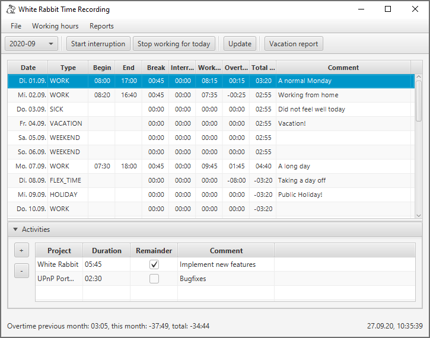

# white-rabbit
A time recording tool

[](https://github.com/itsallcode/white-rabbit/actions?query=workflow%3ABuild)
[](https://sonarcloud.io/dashboard?id=org.itsallcode.whiterabbit%3Awhite-rabbit)
[](https://sonarcloud.io/dashboard?id=org.itsallcode.whiterabbit%3Awhite-rabbit)
[](http://search.maven.org/#search%7Cga%7C1%7Cg%3A%22org.itsallcode.whiterabbit%22%20a%3A%22whiterabbit-plugin-api%22)

* [Features](#features)
* [Usage](#usage)
* [Troubleshooting](#troubleshooting)
* [Changelog](CHANGELOG.md)
* [Development](#development)



## <a name="features"></a>Features

* Records begin, end and interruption of your working day
* Data storage in human readable json files, one file per month
  * Backup data by creating a git repository for the data folder and commit every day
* Supported day types (see json example):
  * Normal working day (default for Monday to Friday): `WORK`
  * Weekend (Saturday and Sunday, detected automatically): `WEEKEND`
  * Public holiday (won't deduct overtime): `HOLIDAY`
  * Vacation (won't deduct overtime): `VACATION`
  * Flex time (will deduct overtime): `FLEX_TIME`
  * Sickness (won't deduct overtime): `SICK`
* Automatic update in the background: just keep it running, and it will record your working time:
  * Start of work is detected when
    * Program start
    * Computer resumes from sleep in the morning
  * Detects the end of work when
    * Program shutdown
    * Computer sleeps for the rest of the day
    * You click the "Stop working for today" button
  * Interruptions detected when computer sleeps for more than 2 minutes
* Generates reports for your vacation and monthly working time
* Detects when a second instance is started to avoid data corruption
* Export project working times to pm-smart. See [below](#pmsmart) for details.

### Java FX user interface

* Double click on a table cell (Type, Begin, End, Interruption and Comment) to edit it
  * Interruptions must be entered as `01:23` for 1 hour, 23 minutes
* Close the window to minimize in the task bar: 
  * Double click  to open the window again
  * Right click on  to add an interruption or exit the program

### Notes

* Won't work on weekends. To force working on a weekend, manually change the day type to `WORK`.
* Public holidays can be calculated using plugin [holidays-calculator](#holidays_calculator) or user can are set the day type to `HOLIDAY` manually.
* If you manually change the working time in previous months you might need to adjust the `overtimePreviousMonth` field in the following months by selecting menu item `File -> Update overtime for all months`.
* Assumptions:
    * Working time of 8h Monday to Friday
    * Mandatory break of 45 minutes after 6 hours of working

## <a name="usage"></a>Usage

### Requirements

* Java Runtime Environment (JRE) 17, e.g. [Eclipse Temurin](https://adoptium.net/).

### Install WhiteRabbit locally

1. Download the [WhiteRabbit executable JAR](https://whiterabbit.chp1.net/whiterabbitfx-signed.jar)
2. Launch it by

  * double clicking
  * executing command

  ```bash
  java -jar whiterabbitfx-signed.jar
  ```

### Install WhiteRabbit via WebStart

1. Install [OpenWebStart](https://openwebstart.com).
2. Download the [WhiteRabbit JNLP file](https://whiterabbit.chp1.net/whiterabbit.jnlp).
3. Start WhiteRabbit by double clicking `whiterabbit.jnlp`. At the first start this will automatically install a new Java Runtime if not available.
4. For the initial start, you need to confirm that the certificate is correct. Verify the fingerprints:
  * SHA1 fingerprint: `89:EB:AC:59:CC:8E:34:42:BF:1F:22:47:BC:D2:94:C3:7A:04:BD:6C`
  * MD5 fingerprint: `A0:55:BC:15:77:DA:A3:97:0B:CD:B1:DF:4C:1A:A6:6A`
5. Confirm that the jar file is downloaded from `https://whiterabbit.chp1.net/whiterabbitfx-signed.jar`.
6. WhiteRabbit will start now, using configuration file `$HOME/.whiterabbit.properties`.

You can also start WhiteRabbit from the command line:

```bash
<OpenWebStartInstllationDir>/javaws https://whiterabbit.chp1.net/whiterabbit.jnlp
# Default for windows:
$USERPROFILE/AppData/Local/Programs/OpenWebStart/javaws https://whiterabbit.chp1.net/whiterabbit.jnlp
```

For details about OpenWebStart see the [OpenWebStart User guide](https://openwebstart.com/docs/OWSGuide.html).

### <a name="configuration"></a>Configuration

White Rabbit will search for the configuration file in the following locations:

1. The path specified via command line parameter `--config=<path>`
2. `time.properties` in the current working directory
3. `$HOME/.whiterabbit.properties`

If the no config file is found, White Rabbit will create a default file at `$HOME/.whiterabbit.properties`, using data directory `$HOME/whiterabbit-data`.

The config file has the following content:

```properties
data = <path-to-data-dir> # e.g.: ../time-recording-data/
```

Restart WhiteRabbit after changing the configuration file.

#### <a name="optional_config"></a>Optional configuration settings

* `locale`: format of date and time values as an [IETF language tag](https://en.wikipedia.org/wiki/IETF_language_tag), e.g. `de`, `de-DE` or `en-GB`. Default: system locale.
  * Note: enter a locale with country code (e.g. `de-DE`) to get correct formatting of date and time, e.g. the calendar week.
* `current_working_time_per_day`: custom working time per day differing from the default of 8 hours. Format: see [Duration.parse()](https://docs.oracle.com/en/java/javase/11/docs/api/java.base/java/time/Duration.html#parse(java.lang.CharSequence)), e.g. `PT5H` for 5 hours or `PT5H30M` for 5 hours and 30 minutes. This setting will only affect the future.

#### <a name="project_config"></a>Project configuration

To use activity tracking, create file `projects.json` in your data directory with the following content:

```json
{
    "projects": [
        {
            "projectId": "p1",
            "label": "Project 1",
            "costCarrier": "P1001"
        },
        {
            "projectId": "p2",
            "label": "Project 2",
            "costCarrier": "P1002"
        },
        {
            "projectId": "general",
            "label": "General",
            "costCarrier": "P0001"
        },
        {
            "projectId": "training",
            "label": "Training",
            "costCarrier": "P0002"
        }
    ]
}
```

#### <a name="plugins"></a>Using Plugins

1. Download one of the available plugins:
    * [pmsmart](https://whiterabbit.chp1.net/plugins/pmsmart-plugin-signed.jar): Export project working time to pm-smart, see [details](#pmsmart).
    * [holidays-calculator](https://whiterabbit.chp1.net/plugins/holidays-calculator-plugin-signed.jar): Calculate holidays based on simple formulas, see [details](#holidays_calculator).
    * [csv](https://whiterabbit.chp1.net/plugins/csv-plugin-signed.jar): Export monthly reports to CSV, see [details](#csvexport).
    * [demo](https://whiterabbit.chp1.net/plugins/demo-plugin-signed.jar): Sample plugin without specific functionality.
1. Copy the downloaded plugin to `$HOME/.whiterabbit/plugins/`.

```bash
for plugin in pmsmart holidays-calculator csv demo
do
    fileName=$plugin-plugin-signed.jar
    curl https://whiterabbit.chp1.net/plugins/$fileName --output $HOME/.whiterabbit/plugins/$fileName
done
```

#### Logging

WhiteRabbit logs to stdout and to `$data/logs/white-rabbit.log` where `$data` is the data directory defined in the [configuration](#configuration).

#### <a name="pmsmart"></a>Using pm-smart

##### Requirements for using pm-smart export

* Microsoft Edge browser with password-less access to pm-smart

##### Setup and usage

1. Create a project configuration as described [above](#project_config). Make sure to use the same IDs for `costCarrier` as in pm-smart.
1. Make sure to install the latest version of the pmsmart plugin, see [above](#plugins) for details.
1. Add the base URL of your pm-smart server to the configuration file:

    ```properties
    pmsmart.baseurl = http://my-pmsmart.example.com
    ```

1. In pm-smart open the week view ("Wochenansicht") and add favorites for all projects you use. The export will only work for projects added as favorite.
1. Start the export in WhiteRabbit:

    1. Select the month that you want to export
    1. Select menu Reports > Project report
    1. Click button "Export to pmsmart"

##### Optional configuration settings

Optionally you can configure pmsmart plugin to skip transfer of a comment for each activity.

For each activity in WhiteRabbit you can enter a comment. By default pmsmart plugin transfers these comment to pm-smart. As the web ui is quite slow, transfer of comments can take a while. If you want to speed-up pm-smart export by skipping transfer of comments you can add an optional property to WhiteRabbit configuration file:

```properties
pmsmart.transfer.comments = false
```

Optionally you can configure pmsmart plugin to clear durations for all other projects, not matching any activity recorded in WhiteRabbit.

For each day pm-smart plugin by default transfers the durations of all activities entered into WhiteRabbit. If pm-smart contains durations for other projects then pm-smart plugin does not overwrite these. This will especially happen if users export their time recordings for a particular month multiple times and change the selection of activities in between. In order to ensure consistent data in pm-smart you can add an optional property to WhiteRabbit configuration file:

```properties
pmsmart.clear_other_projects = true
```

#### <a name="holidays_calculator"></a>Using holidays-calculator

Optionally you can configure holidays-calculator plugin to enable WhiteRabbit to display your personal selection of holidays.

##### Setup and usage

Create a file named `holidays.cfg` in your data directory defined in the [configuration file](#configuration) of WhiteRabbit.

You can use one of the <a href="https://github.com/itsallcode/holiday-calculator/tree/main/holidays">predefined holiday definition files</a> or you can edit the file
and add or remove holidays to your own taste, see the <a href="https://github.com/itsallcode/holiday-calculator/blob/main/README.md#configuration-file">holiday-calculator documentation</a> for a detailed description of the syntax.

**Note:** WhiteRabbit adds holidays provided by plugins only to new months without any time recordings. As soon as the user adds a time recording for a particular month, WhiteRabbit saves the time recordings for this month including any holidays whether provided by plugins or entered manually. After this point in time for the given month WhiteRabbit uses only on the saved file and will not ask any plugin to update the holidays.

### <a name="development"></a>Development

#### Clone and configure

```bash
mkdir time-recording-data
git clone https://github.com/itsallcode/white-rabbit.git
cd white-rabbit
# Configure
echo "data = $HOME/time-recording-data/" > $HOME/.whiterabbit.properties
```

#### <a name="csvexport"></a>Using csv export

##### What can it do / limitations.

CSVExport plugin supports the export of the current monthly report to
a pre-configured path. The file names are hard coded, and have the format
of `YYYY-MM_working_time.csv`.
Please note that all days must have a valid project assigned for
the correct export.

##### Setup and usage

1. Create a project configuration as described [above](#project_config).
1. Make sure to install the latest version of the csv plugin, see [above](#plugins) for details.
1. Start the export in WhiteRabbit:

    1. Select the month that you want to export
    1. Select menu Reports > Project report
    1. Click the "Export to csv" button

#### Optional configuration settings

Currently, you can configure the destination path, separator and flag in WhiteRabbit's configuration file:

```properties
csv.destination = ~/working_time_reports
csv.separator = \t
csv.filter_for_weekdays = True
```

The default values are:

```properties
csv.destination = $HOME
csv.separator = ","
csv.filter_for_weekdays = False
```

### <a name="troubleshooting"></a>Troubleshooting

#### Launching via WebStart fails

```
java.util.ServiceConfigurationError: org.itsallcode.whiterabbit.api.Plugin: Provider org.itsallcode.whiterabbit.plugin.csv.CSVExporterPlugin could not be instantiated
```

Loading local plugins from `$HOME/.whiterabbit/plugins/` is not supported when starting WhiteRabbit via WebStart. This will be fixed in [issue #77](https://github.com/itsallcode/white-rabbit/issues/77).


Workaround: delete local plugins

```bash
rm -i $HOME/.whiterabbit/plugins/*.jar
```

#### Not all plugins are availble when launching via WebStart

Your `whiterabbit.jnlp` file might be outdated and not contain newer plugins. Please download the latest version from [here](https://whiterabbit.chp1.net/whiterabbit.jnlp).

## <a name="development"></a>Development

### Clone and configure

```bash
mkdir time-recording-data
git clone https://github.com/itsallcode/white-rabbit.git
cd white-rabbit
# Configure
echo "data = $HOME/time-recording-data/" > $HOME/.whiterabbit.properties
```

### Build and launch

```bash
# Build WhiteRabbit and install plugins to $HOME/.whiterabbit/plugins/
./gradlew build installPlugins
# To skip unit and ui-tests, run
./gradlew build installPlugins -x test -x uiTest
# Run
java -jar jfxui/build/libs/white-rabbit-fx-<version>[-SNAPSHOT].jar

# Build and run, loading plugins from $HOME/.whiterabbit/plugins/
./gradlew run

# Build and run including plugins. Useful when developing plugins.
# Make sure to remove unwanted plugins from $HOME/.whiterabbit/plugins/
./gradlew runWithPlugins
```

### Run UI-Tests

```bash
# Headless (default)
./gradlew check
# Not Headless (don't move mouse while running)
./gradlew check -PuiTestsHeadless=false
```

### Check that dependencies are up-to-date

```bash
./gradlew dependencyUpdates
```

### Deployment

This will build WhiteRabbit, upload it to the AWS S3 bucket and publish the plugin api to Maven Central.

#### Initial setup

1. Setup [keystore and AWS configuration](webstart/README.md).
2. Add the following to your `~/.gradle/gradle.properties`:

    ```properties
    ossrhUsername=<your maven central username>
    ossrhPassword=<your maven central passwort>

    signing.keyId=<gpg key id (last 8 chars)>
    signing.password=<gpg key password>
    signing.secretKeyRingFile=<path to secret keyring file>
    ```

#### <a name="build_and_deploy"></a>Build and deploy

1. Make sure the [Changelog](CHANGELOG.md) is updated
2. Run the following command:

    ```bash
    ./gradlew clean build publish closeAndReleaseRepository webstart:publishWebstart --info -PreleaseVersion=<version>
    ```

    The release will be written to `jfxui/build/libs/white-rabbit-fx-<version>.jar` and the uploaded content will be available at [whiterabbit.chp1.net](https://whiterabbit.chp1.net). Snapshots will be available at [oss.sonatype.org](https://oss.sonatype.org/content/repositories/snapshots/org/itsallcode/whiterabbit/).

3. Create a new [release](https://github.com/itsallcode/white-rabbit/releases) in GitHub and attach the built jar.
4. Close the [milestone](https://github.com/itsallcode/white-rabbit/milestones) in GitHub.
5. After some time the release will be available at [Maven Central](https://repo1.maven.org/maven2/org/itsallcode/whiterabbit/).

### Managing WebStart configuration in a private branch

This project requires some configuration files with deployment specific information, e.g. domain names that should not be stored in a public git repository. That's why these files are added to `.gitignore`. If you want to still keep your configuration under version control you can do so in a private branch (e.g. `private-master`) that you push to a private repository only.

When switching from `private-master` to the public `develop` branch, git will delete the configuration files. To restore them you can run the following command in the project root:

```bash
git show private-master:webstart-infrastructure/config.ts > webstart-infrastructure/config.ts \
    && git show private-master:webstart/webstart.properties > webstart/webstart.properties \
    && git show private-master:webstart/keystore.jks > webstart/keystore.jks
```
